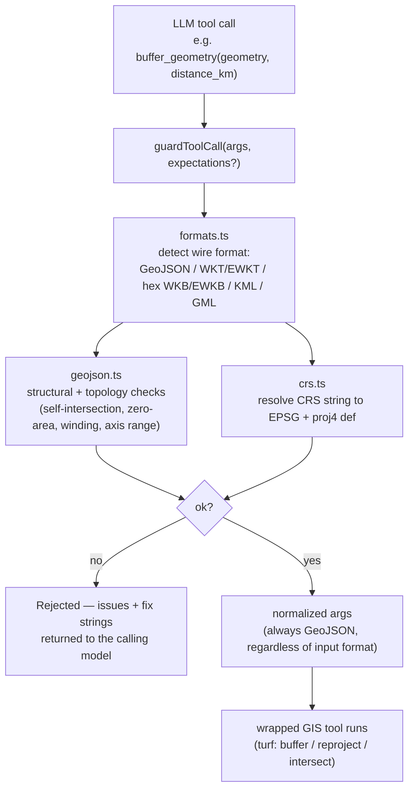
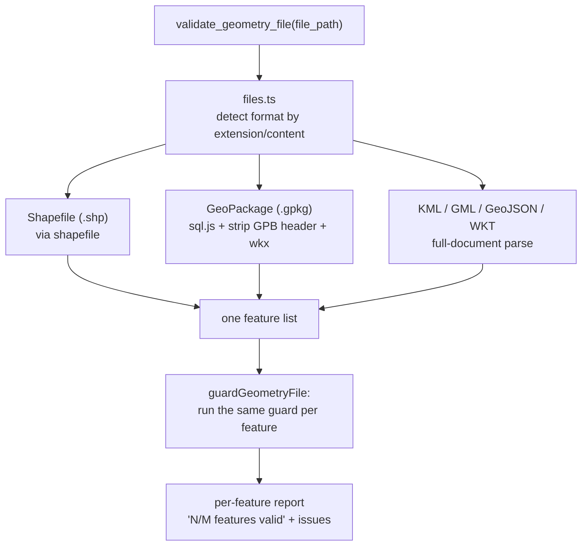

# Groundtruth

> **LangGraph for GIS** — an open, model-agnostic validation layer that catches an LLM's bad CRS, geometry, and topology before it reaches your GIS pipeline, across GeoJSON, WKT/WKB, KML/GML, Shapefile, and GeoPackage.

Status: early working prototype (v0.1.0), not a validated product — see [PITCH.md](PITCH.md) for the business case and [VALIDATION.md](VALIDATION.md) for the decision gate on whether to invest further.

## Features

- **Multi-format geometry detection and normalization** — GeoJSON, WKT/EWKT, hex WKB/EWKB, inline KML/GML fragments (as tool-call arguments), plus whole Shapefile (`.shp`) and GeoPackage (`.gpkg`) files. Everything normalizes to GeoJSON before it reaches validation or a GIS library.
- **Structural + topology validation** aimed at documented LLM failure modes: swapped lat/lng axes, self-intersecting polygons, zero-area/degenerate rings, mishandled antimeridian crossings, wrong winding order (RFC 7946 right-hand rule), and a centroid passed where an actual polygon boundary was needed.
- **CRS resolution** for the free-form strings an LLM actually writes ("WGS84", "Web Mercator", "British National Grid", "UTM zone 33N", `EPSG:4326`) — fails closed on anything it can't confidently resolve rather than guessing.
- **An MCP server** exposing 5 tools (`validate_geometry`, `validate_geometry_file`, `buffer_geometry`, `reproject_geometry`, `intersect_geometries`), each wrapped in the guard so bad input is rejected with an explanation before any GIS work runs.
- **A CLI** (`groundtruth validate <file>`) for validating a file outside any agent loop — CI checks, quick sanity checks, whatever.
- **A library API** (`guardToolCall`, `guardGeometry`, `guardGeometryFile`) for embedding the guard directly in your own agent or tool-calling loop.
- **A real benchmark suite** (`npm run bench`) measuring detection rate against a labeled corpus and raw throughput per format — see [BENCHMARKS.md](BENCHMARKS.md).

## Architecture

Two paths through the same validation core, depending on whether the geometry arrives inline in a tool call or lives in a file the model can only reference by path.

**Path 1 — inline tool-call argument:**



**Path 2 — file-based (can't be embedded inline):**



Both paths share the same structural, topology, and CRS checks — the only difference is how many features go through them at once.

### Project layout

- `src/core/formats.ts` — detects and parses a single geometry-shaped input regardless of wire format: native GeoJSON, WKT/EWKT strings (`"POLYGON((...))"`, `"SRID=4326;POINT(...)"`), hex-encoded WKB/EWKB, or an inline KML/GML XML fragment. WKT/KML/GML detection is confident (a matched keyword or tag means the caller meant this to be a geometry, so a parse failure is a reported `malformed_*` error); WKB detection is conservative (a hex-looking string is only treated as WKB if it actually parses as one, so an unrelated hex id or hash is left alone).
- `src/core/xml-geometry.ts` — shared KML/GML geometry extraction used by both the inline path and the file-based path. Scope is deliberately bounded to Point/LineString/Polygon and their Multi* variants (no curves, no surfaces with interpolation); GML axis order is read as (longitude, latitude), the de-facto convention for most real-world WFS/GML output — strict EPSG:4326 (latitude, longitude) axis order is a documented limitation, not silently guessed.
- `src/core/files.ts` — reads a geometry **file** of any supported format and yields every feature it contains, since Shapefile/GeoPackage can't be embedded inline in a tool call the way WKT/KML can. GeoPackage support is hand-rolled on `sql.js` (pure WASM SQLite, no native build step): it reads `gpkg_geometry_columns` to find the geometry table(s), then strips the small GeoPackageBinary header and hands the remaining WKB to the same parser used for inline WKB.
- `src/core/crs.ts` — resolves free-form CRS strings to canonical EPSG codes and proj4 defs.
- `src/core/geojson.ts` — structural GeoJSON validation plus topology sanity checks.
- `src/core/guard.ts` — `guardToolCall(args, expectations?)`, the library entry point. `expectations` lets a caller declare which geometry type an argument must be (e.g. `{ geometry: { type: "Polygon" } }`), catching the #1 GeoBenchX failure mode — a centroid passed where the actual boundary was needed.
- `src/mcp/server.ts` — the MCP server. Inline tools accept GeoJSON, WKT/EWKT, hex WKB/EWKB, or KML/GML as a `geometry` argument; `validate_geometry_file` takes a `file_path` instead.
- `src/cli.ts` — the standalone CLI. Format is auto-detected (by extension first, then content): `.geojson`/`.json`, `.wkt`, `.kml`, `.gml`/`.xml`, `.shp`, `.gpkg`.
- `bench/` — the benchmark suite; `examples/fixtures/` — a shareable good/bad corpus per format with captured real output in `RESULTS.md`.

## Getting started

```bash
npm install
npm test                                   # unit tests for CRS resolution, structural validation, topology, and type checks
npm run bench                              # detection-rate + throughput benchmark (see BENCHMARKS.md)
npm run demo                               # runs guardToolCall over a handful of clean and deliberately broken tool calls
npm run dev:mcp                            # starts the MCP server on stdio — point an MCP client (e.g. Claude Desktop/Code) at it
npm run cli -- validate parcel.geojson     # validate a file directly; add --type Polygon to assert the expected shape
npm run cli -- validate parcels.shp        # Shapefile, GeoPackage, KML, GML, WKT text all work the same way
```

## Usage

### As an MCP server (agent tool-call validation)

```bash
npm run build
claude mcp add groundtruth -- node dist/mcp/server.js
```

Exposes `validate_geometry`, `validate_geometry_file`, `buffer_geometry`, `reproject_geometry`, `intersect_geometries` to any MCP-compatible client (Claude Code, Claude Desktop's local servers, etc.).

### As a library (embed the guard in your own agent loop)

```ts
import { guardToolCall } from "groundtruth";

const result = guardToolCall({
  geometry: { type: "Point", coordinates: [37.77, -122.42] }, // lat/lng swapped
});
// result.ok === false
// result.issues[0].code === "lat_out_of_range"
// result.issues[0].fix === "GeoJSON positions are always [longitude, latitude]. ..."

// The same guard accepts WKT/EWKT and hex WKB/EWKB too, and normalizes
// whatever it receives to GeoJSON for the tool underneath:
const wktResult = guardToolCall({ geometry: "POLYGON((0 0, 0 1, 1 1, 1 0, 0 0))" });
// wktResult.formats.geometry === "wkt"
// wktResult.normalized.geometry === { type: "Polygon", coordinates: [[[0,0],[0,1],[1,1],[1,0],[0,0]]] }

// Files (including formats that can't be embedded inline, like Shapefile
// and GeoPackage) go through guardGeometryFile instead — it validates
// every feature the file contains, not just one:
import { guardGeometryFile } from "groundtruth";

const fileResult = await guardGeometryFile("parcels.shp", { type: "Polygon" });
// fileResult.totalFeatures, fileResult.invalidFeatures
// fileResult.issues[i].featureIndex identifies which feature an issue belongs to

// Assert the geometry type a tool actually needs, e.g. before an intersect:
const intersectArgs = guardToolCall(
  { geometry_a, geometry_b },
  {
    geometry_a: { type: ["Polygon", "MultiPolygon"] },
    geometry_b: { type: ["Polygon", "MultiPolygon"] },
  },
);
// Rejects a centroid passed in place of the polygon it summarizes, with an
// explicit fix instruction instead of a downstream crash or silent no-op.
```

### As a CLI (CI checks, quick sanity checks)

```bash
groundtruth validate parcels.gpkg
# parcels.gpkg: 8/10 features valid (geopackage)
#   [error] feature[3]: self_intersection: Polygon is self-intersecting at 1 point(s).
#     fix: Simplify or rebuild the polygon so its rings don't cross themselves...
```

## Results

Real, reproducible numbers from `npm run bench` — full methodology, caveats, and known limitations in [BENCHMARKS.md](BENCHMARKS.md):

- **13/13** documented failure modes correctly detected, **0** false positives across the clean corpus
- **7 wire formats** validated end to end: GeoJSON, WKT/EWKT, WKB/EWKB, KML, GML, Shapefile, GeoPackage
- **25,000–560,000 validations/sec** depending on format (GeoJSON/WKT/WKB in-process; KML/GML pay for an XML parse)
- Building the benchmark corpus itself surfaced and fixed one real gap: a geometry-shaped tool-call argument with a misspelled/miscased `type` (e.g. `"point"`, `"Polgyon"`) was previously skipped by the guard entirely instead of being flagged — see BENCHMARKS.md for the full writeup

## Further reading

- [PITCH.md](PITCH.md) — the business case: why this matters, market signal, competitive landscape, scoring
- [VALIDATION.md](VALIDATION.md) — the validation plan and decision gate for whether to invest further
- [BENCHMARKS.md](BENCHMARKS.md) — full benchmark methodology, real numbers, and known limitations
- [examples/fixtures/RESULTS.md](examples/fixtures/RESULTS.md) — real `groundtruth validate` output for a good/bad pair per format
